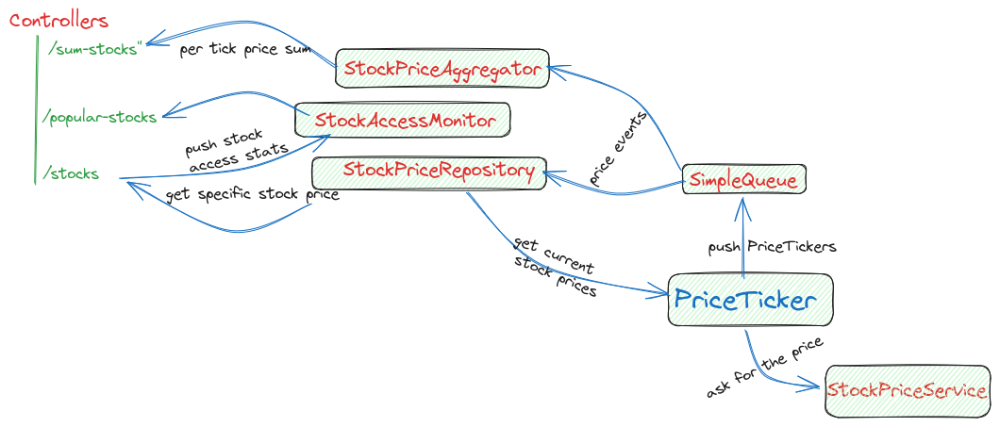

#### Stock prediction web app simulator
[Assignment](./docs/assignment.MD)

### Concept

Main components:
- ``StockPriceService`` - wraps the pricing provided function into an async service so each call would be computed on a
  thread extracted from a cached thread pool
- ``PriceTicker`` - Schedules periodically (every second) a job that invokes the pricing service for every tick
- ``Simple Queue`` - Simple blocking queue concept that uses a single thread consumer that pushed the events to the subscriber. 
Used to decouple the price consumers from the ``PriceTicker`` (we don't want the ticker to be affected by the upstream consumer performance)
- ``StockPriceRepository`` - ConcurrentMap backed repository to store the stock values. It updates the prices by subscribing to the PriceTickers queue
- ``StockAccessMonitor`` - stores the stock access count into a concurrent map (I though is enough :))
- ``StockPriceAggregator`` - it aggregates all stock prices per tick. Some locking, the sums are updated by a single thread, but read is done by multiple and it requires synchronization
### TODO
- improve exception handling
- graceful application and thread-pools shutdown